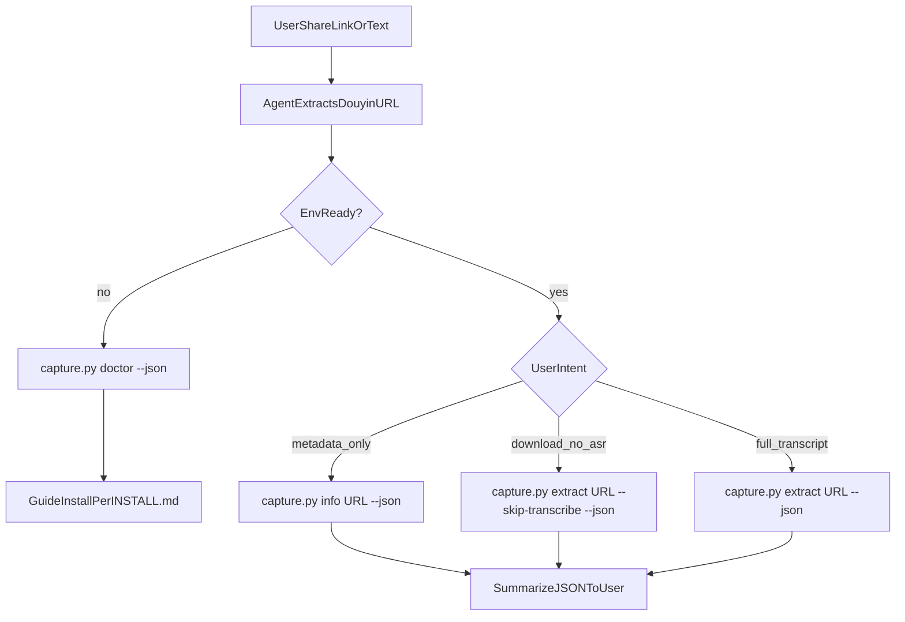

# Douyin Content Capture

从抖音分享链接或整段分享文案，本地完成解析、无水印下载与文案提取（视频 Whisper 转写，图文直接取配文）。**无需登录 Cookie，无需云端语音 API。**

## Agent rules

1. **Never parse Douyin pages yourself.** Do not fetch CDN URLs or parse `_ROUTER_DATA` manually. Always run `scripts/capture.py`.
2. **Run `doctor` when the environment is unknown** before `extract`. Guide install per [INSTALL.md](references/INSTALL.md) if dependencies are missing.
3. **Use `--json` and read stdout JSON only.** Do not paste raw HTML or CDN URLs to the user unless they explicitly ask for the download link.
4. **Default output directory:** `~/Downloads/douyin-capture` (do not write into the user's project workspace unless they ask).
5. **Progress handling:** surface CLI stderr progress lines as-is. They now use percentage format like `10%`, `35%`, `70%`, `100%`.
6. **Final user response format is strict:** after success, output only:
   - `transcript_preview`
   - `浏览器访问`: use `entrypoints.browser_html`
   - `打开文件目录`: use `entrypoints.open_folder`
   Do not add summary, interpretation, guessing, quality comments, or extra explanation unless the user explicitly asks.
7. **Directory naming:** output folders must stay short and stable. Use the generated clean slug; do not reconstruct the path from title text in the response.
8. **HTML delivery:** every successful `extract` now writes `index.html` into the output directory. Report that path as one of the artifacts.
9. **Progressive reference:** link formats → [URLS.md](references/URLS.md); output schema → [OUTPUT.md](references/OUTPUT.md); failures → [TROUBLESHOOTING.md](references/TROUBLESHOOTING.md).

## Decision flow



## Quick start

```bash
SKILL_ROOT="<path-to>/douyin-content-capture"
cd "$SKILL_ROOT/scripts"

# First-time setup
python3 -m venv .venv && source .venv/bin/activate
python -m pip install -r requirements.txt

# Check environment
python capture.py doctor --json

# Metadata only
python capture.py info "https://v.douyin.com/xxxxx/" --json

# Full extract (download + transcribe for video)
python capture.py extract "https://v.douyin.com/xxxxx/" --json

# Download video only, skip Whisper
python capture.py extract "https://v.douyin.com/xxxxx/" --skip-transcribe --json
```

Replace `SKILL_ROOT` with the directory containing this `SKILL.md`. The wrapper script installs and calls the bundled `python-package/` tool inside the same plugin.

## CLI reference

| Command | Purpose |
|---------|---------|
| `capture.py doctor [--json]` | Check Python, ffmpeg, packages |
| `capture.py info URL [--json]` | Resolve metadata only |
| `capture.py extract URL [--json]` | Full pipeline |

### `extract` options

| Option | Default | Description |
|--------|---------|-------------|
| `-o`, `--output` | `~/Downloads/douyin-capture` | Output root directory |
| `--model` | `small` | Whisper model: tiny, base, small, medium, large-v2, large-v3 |
| `--skip-transcribe` | off | Download only; skip FFmpeg + Whisper for video |

## JSON contracts

### `doctor --json`

```json
{
  "ok": true,
  "python": { "ok": true, "version": "3.12.0", "executable": "..." },
  "ffmpeg": { "ok": true, "path": "/usr/bin/ffmpeg" },
  "packages": { "requests": { "ok": true }, "faster_whisper": { "ok": true }, "zhconv": { "ok": true } },
  "errors": [],
  "scripts_dir": "..."
}
```

`ok: true` means Python 3.10+ and `requests` are available (enough for `info`). `errors` lists everything still missing for full video transcription.

### `info URL --json`

```json
{
  "ok": true,
  "aweme_id": "7640082170305090171",
  "title": "...",
  "author": "...",
  "content_type": "video",
  "download_url": "https://...",
  "cover_url": "https://...",
  "image_urls": []
}
```

`content_type` is `video` or `image`. Image notes have `image_urls` instead of `download_url`.

### `extract URL --json`

```json
{
  "ok": true,
  "output_root": "/Users/name/Downloads/douyin-capture",
  "out_dir": "/Users/name/Downloads/douyin-capture/7640082170305090171-clean-slug",
  "out_dir_name": "7640082170305090171-clean-slug",
  "aweme_id": "...",
  "title": "...",
  "author": "...",
  "content_type": "video",
  "transcript": "简体文案正文",
  "transcript_preview": "固定长度截断预览",
  "transcript_preview_max_chars": 200,
  "files": { "html": "index.html", "video": "video.mp4", "transcript": "transcript.md", "meta": "meta.json" },
  "artifacts": { "html": "/Users/name/.../index.html", "video": "/Users/name/.../video.mp4", "transcript": "/Users/name/.../transcript.md", "out_dir": "/Users/name/.../" },
  "entrypoints": { "browser_html": "/Users/name/.../index.html", "open_folder": "/Users/name/.../" },
  "skip_transcribe": false
}
```

On failure, any command returns `{ "ok": false, "error": "..." }` with exit code 1.

## Reporting to the user

After a successful `extract`, output only:

- `transcript_preview`
- `浏览器访问`
- `打开文件目录`

Use `entrypoints.browser_html` for the browser link and `entrypoints.open_folder` for the folder link.
Do not include title, author, content_type summaries, guesses about the audio, or any explanatory note unless the user explicitly asks for them.

## Intent mapping

| User says | Command |
|-----------|---------|
| 看看这个抖音是什么 / 获取信息 | `info --json` |
| 下载无水印 / 不要转写 | `extract --skip-transcribe --json` |
| 提取文案 / 转字幕 / 语音识别 | `extract --json` |
| 图文 / note | `extract --json` (no Whisper; uses desc) |

## Limitations

- No OCR for text embedded in images
- No login / private content
- Video transcription is slow on CPU (minutes for long videos with `small` model)
- For research and personal use; comply with platform terms and local law
